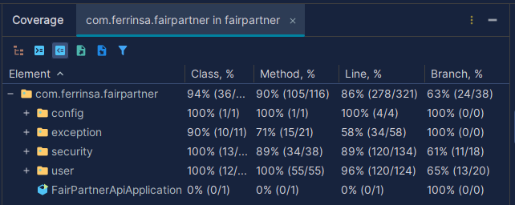

# FairPartner – Backend

Backend REST API desarrollada con **Java y Spring Boot 3.5.4** para la aplicación FairPartner, orientada a la gestión de gastos compartidos.

Este repositorio representa una **extracción del backend** de un proyecto mayor desarrollado en un entorno privado (monorepo). Su finalidad es mostrar el diseño, modelado y evolución del backend aplicando criterios de arquitectura profesional y buenas prácticas de ingeniería de software.

El código se mantiene sincronizado desde el repositorio principal mediante una estrategia de versionado independiente, permitiendo exponer públicamente el backend sin comprometer el entorno de desarrollo privado.

---

## 🧩 Tech Stack

- Java 17
- Spring Boot
- Spring Security
- JWT
- Spring Data JPA (Hibernate)
- MySQL
- H2 (testing)
- Maven

---

## 🚀 Ejecución

**Requisitos previos:**
- Java 17
- Maven

1. Clonar el repositorio.
2. Configurar las variables de entorno (ver sección [Configuración](#-configuración)).
3. Ejecutar:

```
mvn clean install
mvn spring-boot:run
```

---

## 🎯 Objetivo del repositorio

El propósito de este proyecto es reflejar:

- Diseño de un backend estructurado y escalable.
- Modelado explícito de dominio.
- Aplicación de principios **Clean Code** y **SOLID**.
- Separación clara de responsabilidades.
- Flujo de trabajo profesional (`main` / `develop`, convenciones de commit, documentación técnica).

---

## 🏗 Arquitectura

El proyecto sigue una arquitectura por capas, con separación clara entre dominio e infraestructura:

- **Controller** → Exposición de endpoints REST.
- **Service** → Lógica de negocio y reglas de dominio.
- **Repository** → Persistencia mediante Spring Data JPA.
- **DTOs (`record`)** → Desacoplamiento entre dominio y capa de transporte.
- **Exception Handling** → Manejo centralizado de excepciones por contexto funcional.
- **Security Layer** → Configuración y aislamiento completo del módulo de seguridad.

Se evita el acoplamiento entre capas y se prioriza la claridad estructural frente a la complejidad innecesaria.

La API se expone bajo el context-path /api.

---

## 📈 Escalabilidad del modelo

Aunque la aplicación está orientada inicialmente a gestión de gastos en pareja, el modelo de datos ha sido diseñado para permitir la evolución hacia grupos con múltiples participantes.

- Relaciones N:M correctamente modeladas.
- Restricción actual del número de usuarios gestionada a nivel de configuración.
- Separación clara entre lógica de negocio y estructura de datos.
- Preparado para futura ampliación sin rediseño estructural de la base de datos.

---

## 🧠 Principios aplicados

- Clean Code.
- Principios SOLID.
- Responsabilidad única en servicios.
- Inversión de dependencias.
- Separación estricta entre dominio y autenticación.
- DTOs inmutables mediante `record`.
- Validación declarativa con Jakarta Validation.
- Transacciones explícitas en capa de servicio.
- Excepciones específicas por dominio.
- Diseño orientado a escalabilidad futura (grupos, roles, extensibilidad del modelo).

---

## 🔐 Seguridad

El sistema implementa autenticación y autorización mediante **Spring Security** y **JWT**, siguiendo un enfoque completamente stateless.

### Componentes principales

- `SecurityConfig` → Configuración central de seguridad.
- `PasswordEncoderConfig` → Gestión de codificación segura de contraseñas.
- `JwtTokenProvider` → Generación y validación de tokens.
- `JwtTokenFilter` → Filtro personalizado para validación por petición.
- `JwtAuthenticationEntryPoint` → Manejo de errores de autenticación.
- `CustomUserDetailsService` → Integración del modelo de usuario con Spring Security.
- Gestión de roles desacoplada del dominio principal.
- Validación personalizada de contraseña mediante anotaciones propias.

El módulo de seguridad se encuentra completamente aislado en el paquete `security`, evitando contaminación del dominio funcional.

---

## 🧪 Testing

La rama main representa el núcleo estable y completamente testado del sistema.

Incluye:

- Tests de integración con Spring Boot.
- Validación completa del flujo de autenticación JWT.
- Tests del módulo `user`.
- Base de datos H2 para entorno de pruebas.

Cobertura aproximada en los módulos críticos:  
- ~90% métodos  
- ~86% líneas  



Se ha priorizado el testing exhaustivo de los componentes críticos del sistema (autenticación y gestión de usuarios), con una estrategia definida para ampliar progresivamente la cobertura al resto de módulos del dominio.

---

## 📘 Documentación de API

El proyecto incluye documentación interactiva de la API mediante **Springdoc OpenAPI (Swagger)**.

Una vez ejecutada la aplicación, puede consultarse en:

- http://localhost:8080/api/swagger-ui/index.html  
- http://localhost:8080/api/doc

La documentación se genera automáticamente a partir de los controladores y modelos definidos en el sistema.

---

## 🗄 Base de datos

La documentación técnica se encuentra en:

[docs/database](docs/database)

Incluye:

- Modelo conceptual.
- Modelo lógico.
- Scripts SQL.
- Script específico para entorno de pruebas con H2.

Base de datos principal: **MySQL**  
Entorno de testing: **H2**

El modelo ha sido diseñado para permitir evolución progresiva del dominio.

---

## ⚙ Configuración

La aplicación utiliza variables de entorno mediante archivo `.env`.

Variables mínimas requeridas:

```
DB_URL=jdbc:mysql://localhost:3306/fairpartner_db?serverTimezone=UTC
DB_USER=usuario
DB_PASSWORD=contraseña
JWT_SECRET=clave_secreta_segura
```

La ausencia de estas variables impedirá el arranque de la aplicación.

Se recomienda el uso de herramientas como EnvFile (IntelliJ) o configuración directa en el entorno del sistema.

---

## 🔄 Flujo de trabajo

El proyecto sigue una estrategia de ramas clara:

- `develop` → Desarrollo activo.
- `main` → Versión estable.

Los commits siguen convención estructurada:

- feat
- fix
- refactor
- chore
- docs
- style

Especificación completa:

[docs/commit-convention.md](docs/commit-convention.md)

---

## 📌 Estado del proyecto

El backend se encuentra en desarrollo activo y está preparado para ampliar la lógica de dominio (gestión de gastos y grupos) manteniendo la arquitectura actual.
El modelo y la documentación pueden evolucionar conforme se amplíe la lógica de negocio.


Este repositorio muestra el estado actual del backend como módulo independiente.


---

## 📄 Licencia

Este proyecto se distribuye bajo licencia MIT.

