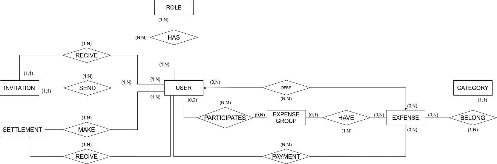

# Modelo conceptual de la base de datos

### Diagrama
<figure align="center">
  
</figure>

---

## Entidad: User

**Descripción**:  
Representa un usuario registrado en la aplicación capaz de gestionar gastos compartidos y participar en grupos de gastos.

### Atributos

- `id`: Identificador único del usuario.
- `name`: Nombre del usuario.
- `email`: Correo electrónico único del usuario.
- `password_hash`: Contraseña cifrada del usuario.
- `registration_date`: Fecha de registro del usuario.

### Relaciones

- Puede participar en muchos **ExpenseGroup**.
- Puede crear muchas **Invitation**.
- Puede recibir muchas **Invitation**.
- Puede crear muchos **Expense**.
- Puede realizar muchos **Payment**.
- Puede participar en muchos repartos de gasto mediante **ExpenseShare**.
- Puede crear y recibir muchos **Settlement**.
- Puede tener uno o varios **Role**.

---

## Entidad: Role

**Descripción**:  
Representa un rol de seguridad asignado a los usuarios de la aplicación.

### Atributos

- `id`: Identificador único del rol.
- `name`: Nombre del rol.

### Relaciones

- Un rol puede pertenecer a muchos **User**.
- Un usuario puede tener varios **Role**.

---

## Entidad: ExpenseGroup

**Descripción**:  
Grupo de gastos compartido entre varios usuarios.

### Atributos

- `id`: Identificador único del grupo.
- `name`: Nombre del grupo.
- `description`: Descripción resumida del grupo.
- `icon`: Imagen o icono representativo del grupo.

### Relaciones

- Un grupo puede tener muchos **User** participantes.
- Un grupo puede contener muchos **Expense**.
- Un grupo puede tener muchas **Invitation**.
- Un grupo puede tener muchos **Settlement**.

---

## Entidad: Invitation

**Descripción**:  
Invitación enviada a un usuario para participar en un grupo de gastos.

### Atributos

- `id`: Identificador único de la invitación.
- `token`: Token único de invitación.
- `creation_date`: Fecha de creación de la invitación.
- `expiration_date`: Fecha de expiración de la invitación.
- `status`: Estado actual de la invitación.

### Relaciones

- Una invitación pertenece a un **ExpenseGroup**.
- Una invitación es enviada por un **User**.
- Una invitación es recibida por un **User**.

---

## Entidad: Category

**Descripción**:  
Representa la categoría asociada a un gasto.

### Atributos

- `id`: Identificador único de la categoría.
- `name`: Nombre de la categoría.
- `icon`: Icono representativo de la categoría.

### Relaciones

- Una categoría puede pertenecer a muchos **Expense**.

---

## Entidad: Expense

**Descripción**:  
Representa un gasto realizado dentro de un grupo de gastos.

### Atributos

- `id`: Identificador único del gasto.
- `name`: Nombre del gasto.
- `description`: Descripción resumida del gasto.
- `created_date`: Fecha de creación del gasto.
- `icon`: Icono representativo del gasto.
- `amount`: Cantidad económica total del gasto.

### Relaciones

- Un gasto pertenece a un **ExpenseGroup**.
- Un gasto pertenece a una **Category**.
- Un gasto es creado por un **User**.
- Un gasto puede tener muchos **Payment**.
- Un gasto puede repartirse mediante muchos **ExpenseShare**.

---

## Entidad: Payment

**Descripción**:  
Representa el pago realizado por un usuario sobre un gasto concreto.

### Atributos

- `amount`: Cantidad pagada por el usuario.

### Relaciones

- Un usuario puede realizar muchos **Payment**.
- Un gasto puede tener muchos **Payment**.

---

## Entidad: ExpenseShare

**Descripción**:  
Representa el reparto económico de un gasto entre los usuarios participantes.

### Atributos

- `amount`: Cantidad asignada al usuario dentro del gasto.

### Relaciones

- Un usuario puede participar en muchos **ExpenseShare**.
- Un gasto puede contener muchos **ExpenseShare**.

---

## Entidad: Settlement

**Descripción**:  
Representa una liquidación de deuda entre usuarios dentro de un grupo de gastos.

### Atributos

- `id`: Identificador único de la liquidación.
- `amount`: Cantidad liquidada.
- `created_date`: Fecha de creación de la liquidación.

### Relaciones

- Una liquidación pertenece a un **ExpenseGroup**.
- Una liquidación es realizada por un **User**.
- Una liquidación es recibida por un **User**.

---

## Consideraciones

El modelo conceptual está orientado a la gestión de gastos compartidos entre usuarios mediante grupos colaborativos.

La arquitectura relacional permite:
- gestionar relaciones N:M entre usuarios y grupos,
- controlar pagos y repartos individuales,
- gestionar invitaciones seguras mediante tokens,
- registrar liquidaciones de deuda entre participantes,
- y mantener separación clara entre autenticación, dominio y persistencia.