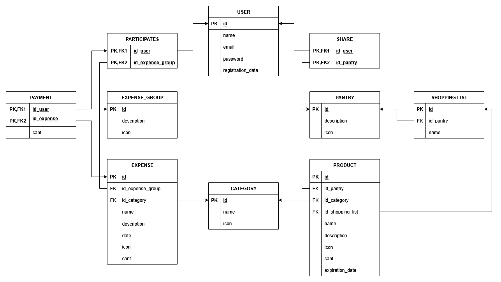

# Modelo lógico de la base de datos

### Diagrama
<figure align="center">
  
</figure>

---

## Consideraciones

* El balance económico de los grupos de gastos es un dato derivado y no persistente.  
  Se calcula dinámicamente a partir de los registros de pagos, repartos y liquidaciones.

* La relación entre usuarios y grupos de gasto se implementa mediante la tabla intermedia `participates`.

* La relación entre usuarios y roles se implementa mediante la tabla intermedia `user_roles`.

* Los gastos permiten múltiples repartos mediante la tabla `expense_share`, posibilitando divisiones de gasto personalizadas.

* Las liquidaciones (`settlement`) representan transferencias de deuda entre usuarios dentro de un grupo de gastos.

* Las invitaciones utilizan tokens únicos para validar el acceso seguro a grupos compartidos.

---

# Especificación

---

User (<u>id</u>, name, email, password_hash, registration_date)  
PK (id)  
NN (name, email, password_hash, registration_date)  
UK (email)

---

Roles (<u>id</u>, name)  
PK (id)  
NN (name)  
UK (name)

---

User_Roles (<u>user_id, role_id</u>)  
PK (user_id, role_id)  
FK (user_id) -> User(id)  
FK (role_id) -> Roles(id)

---

Expense_Group (<u>id</u>, name, description, icon)  
PK (id)  
NN (name, icon)

---

Participates (<u>id_user, id_expense_group</u>)  
PK (id_user, id_expense_group)  
FK (id_user) -> User(id)  
FK (id_expense_group) -> Expense_Group(id)

---

Invitation (<u>id</u>, expense_group_id, inviter_user_id, invited_user_id, token, creation_date, expiration_date, status)  
PK (id)  
FK (expense_group_id) -> Expense_Group(id)  
FK (inviter_user_id) -> User(id)  
FK (invited_user_id) -> User(id)  
NN (expense_group_id, inviter_user_id, invited_user_id, token, creation_date, expiration_date, status)  
UK (token)

---

Category (<u>id</u>, name, icon)  
PK (id)  
NN (name, icon)

---

Expense (<u>id</u>, id_expense_group, id_category, created_by_user_id, name, description, created_date, icon, amount)  
PK (id)  
FK (id_expense_group) -> Expense_Group(id)  
FK (id_category) -> Category(id)  
FK (created_by_user_id) -> User(id)  
NN (id_expense_group, id_category, created_by_user_id, name, created_date, icon, amount)  
CHECK (amount > 0)

---

Payment (<u>id_user, id_expense</u>, amount)  
PK (id_user, id_expense)  
FK (id_user) -> User(id)  
FK (id_expense) -> Expense(id)  
NN (amount)  
CHECK (amount > 0)

---

Expense_Share (<u>id_user, id_expense</u>, amount)  
PK (id_user, id_expense)  
FK (id_user) -> User(id)  
FK (id_expense) -> Expense(id)  
NN (amount)  
CHECK (amount > 0)

---

Settlement (<u>id</u>, id_expense_group, from_id_user, to_id_user, amount, created_date)  
PK (id)  
FK (id_expense_group) -> Expense_Group(id)  
FK (from_id_user) -> User(id)  
FK (to_id_user) -> User(id)  
NN (id_expense_group, from_id_user, to_id_user, amount, created_date)  
CHECK (amount > 0)

---