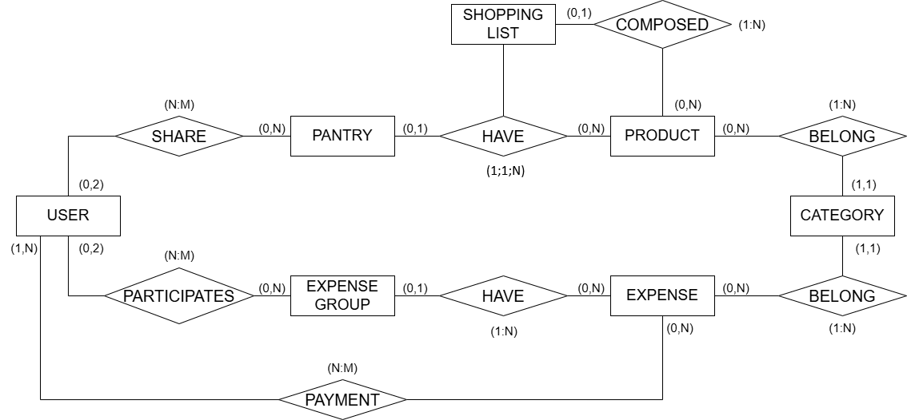

> **Estado:** Documentación pendiente de actualización.  
> El modelo descrito puede no reflejar completamente los últimos cambios realizados en la implementación.

# Modelo conceptual de la base de datos

### Diagrama
<figure align="center">
  
</figure>

## Entidad: User
**Descripción**:  
Persona que utiliza la aplicación para gestionar los gastos y la despensa.

**Atributos**:  
- `id`: Identificador único del usuario.  
- `name`: Nombre completo del usuario.  
- `email`: Correo electrónico del usuario.
- `password`: Contraseña para acceder a la aplicación.  
- `registration_data`: Fecha en la que el usuario se registró.

**Relaciones**:  
- Puede tener muchos **grupos de gastos** y cada grupo puede tener muchos **gastos**.  
- Puede tener muchas **despensa** y cada despensa puede tener muchos **productos**..

---

## Entidad: ExpenseGroup 
**Descripción**:  
Registro de un grupo de gastos compartido entre los usuarios que contendrá los gastos.

**Atributos**:  
- `id`: Identificador único del grupo.  
- `description`: Información resumida del grupo. 
- `icon`: Imagen representativa del grupo.
- `resume`: Cantidad y usuario que debe en el grupo.  

**Relaciones**:  
- Participan máximo dos **usuarios**.  
- Puede tener muchos **gastos**
---

## Entidad: Expense
**Descripción**:  
Gasto compartido entre los usuarios.

**Atributos**:  
- `id`: Identificador único del gasto.
- `name`: Nombre del gasto.   
- `description`: Información resumida del gasto.
- `date`: Fecha de introducción del gasto. 
- `icon`: Imagen representativa de la categoría del gasto.
- `cant`: Cantidad económica del gasto.

**Relaciones**:  
- Un gasto es de un **grupo de gastos**.
- Un gasto pertenece a una **categoría**.
- Un gasto es pagado por uno o muchos **usuarios**.
---

## Entidad: Payment
**Descripción**:  
Representa el pago que un usuario realiza sobre un gasto concreto.

**Atributos**:  
- `cant`: Cantidad pagada por el usuario.  

**Relaciones**:  
- Un usuario realiza muchos pagos.  
- Un gasto puede ser pagado por muchos usuarios.
---

## Entidad: Pantry
**Descripción**:  
Registro de un grupo de despensa compartido entre los usuarios que contendrá los productos.

**Atributos**:  
- `id`: Identificador único de la despensa.  
- `description`: Información resumida de la depensa. 
- `icon`: Imagen representativa de la depensa.

**Relaciones**:  
- Participan máximo dos **usuarios**.  
- Puede tener muchos **productos**.
---

## Entidad: Product
**Descripción**:  
Producto de la despensa compartido entre los usuarios.

**Atributos**:  
- `id`: Identificador único del producto.
- `name`: Nombre del producto.   
- `description`: Información resumida del producto. 
- `icon`: Imagen representativa de la categoría del producto.
- `cant`: Cantidad en existencias del producto.
- `expiration_date`: Fecha de caducidad del producto.   

**Relaciones**:  
- Un producto es de una **despensa**.
- Un producto pertenece a una **categoría**.
---

## Entidad: Category
**Descripción**:  
Representa el tipo de un gasto o producto.

**Atributos**:  
- `id`: Identificador único de la categoría. 
- `name`: Nombre de la categoría. 
- `icon`: Imagen representativa de la categoría.  

**Relaciones**:  
- Un gasto pertenece a una **categoría**.
- Un producto pertenece a una **categoría**.
---

## Entidad: ShoppingList
**Descripción**:  
Representa una lista de la compra asociada a una despensa concreta.

**Atributos**:  
- `id`: Identificador único de la lista.
- `name`: Nombre de la lista. 

**Relaciones**:  
- Una depensa tiene una **lista de la compra** que puede contener muchos productos.
- Un producto solo puede estar en una **lista de la compra**
---

